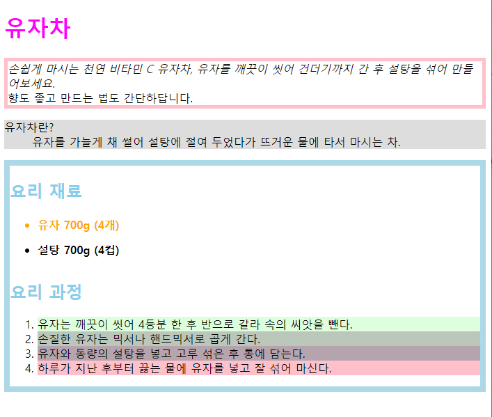

## 230616 자바스크립트 과제기록: document에서 선택자 탐색하기
변경해주고자 하는 선택자를 변수로 설정한 뒤, 스타일 값을 변경

__h1처럼 하나만 존재하는 선택자 설정__

    const h1 = document.querySelector('h1');

__여러개 존재하는 모든 li 선택자 설정__

    const lis = document.querySelectorAll('li');

__ul 안에만 존재하는 모든 li 선택자 설정__

    const liss = document.querySelectorAll('ul > li');